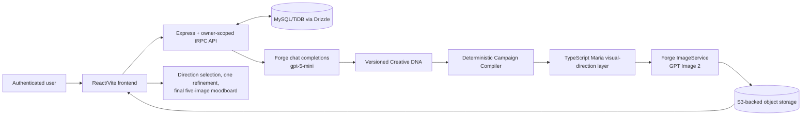

# MIRA Architecture for Audit

## Current product surfaces

| Surface | Verified state | Routes and boundary |
| --- | --- | --- |
| MIRA V4 Brand World | **IMPLEMENTED; current Project 3 creative-direction path** | `/mira-v4` and `/mira-v4/journey/:journeyId`; `miraV4` tRPC namespace; `mira_v4_*` tables. |
| MIRA V3 Recognition | **IMPLEMENTED; still active, not superseded in code** | `/`, `/mira-v3`, journey and results routes; `miraV3` namespace; `mira_v3_*` tables. |
| Level-based `/mira-1` experience | **PARTIAL** | Level 1/2 client routes and procedures reuse the `miraV4` router; later levels and full product positioning are not complete. |
| V4 schema states `brand_dna` / `brand_book` | **DOCUMENTED/SCHEMA-ONLY** | Not rendered as active V4 journey stages; no V4 Brand Book or PDF export pipeline is implemented. |

V3 and V4 share platform services but do not automatically exchange journey data.

## Verified V4 flow

The V4 journey records quick context, birth details, bounded recognition and creative-discovery turns, a creative brief, and an optional inspiration asset. Creative DNA synthesis uses those stored inputs and optional signed image evidence. The Campaign Compiler is deterministic; image generation is provider-backed. Visual-set records use source fingerprints and `in_progress`, `complete`, or `retryable_error` states to support reuse and bounded retries.

## External services and controls

| Service | Verified function | Status |
| --- | --- | --- |
| Manus OAuth/platform authentication | Supplies the authenticated user used by protected procedures and ownership predicates. | **IMPLEMENTED** |
| MySQL/TiDB with Drizzle | Stores users, journeys, answers/messages, Creative DNA, media metadata, revisions, artifacts, and visual-set state. | **IMPLEMENTED** |
| Forge chat-completion service | Adaptive questions and structured synthesis; current V4 services identify `gpt-5-mini`. | **IMPLEMENTED; credential-dependent** |
| Forge ImageService | Initial, refined, and final image generation; default code model is `MODEL_GPT_IMAGE_2`. | **IMPLEMENTED; external usage availability applies** |
| Forge presigning and S3-backed storage | Private uploads, signed reads, PDFs, inspiration assets, and generated images. | **IMPLEMENTED** |
| Dakidarts / Numerology API | Optional V3-only birth-context adapter, enabled only by feature flag and server credential. | **OPTIONAL** |
| Notion API | Optional knowledge retrieval for the level-based V4 extension, with a local fallback. | **OPTIONAL/PARTIAL** |
| Human Design provider | No active provider, credential, route, or calculation was verified. | **NOT IMPLEMENTED** |

## Evidence and limits

- V3 journey screenshots and output PDFs: [`evidence/journey-30001`](../evidence/journey-30001/)
- V3 transcript evidence: [`evidence/journey-60001`](../evidence/journey-60001/)
- V3 verification summary: [`MIRA_V3_STAGING_STATUS.md`](../MIRA_V3_STAGING_STATUS.md)
- V4 state and validation: [`MIRA_V4_CURRENT_STATE.md`](MIRA_V4_CURRENT_STATE.md) and [`V4_REFINEMENT_RETRY_VALIDATION.md`](V4_REFINEMENT_RETRY_VALIDATION.md)

The code confirms private-staging architecture and provider boundaries, but production hosting, service regions, operational retention schedules, and current production traffic are **not confirmed from the available implementation**.
